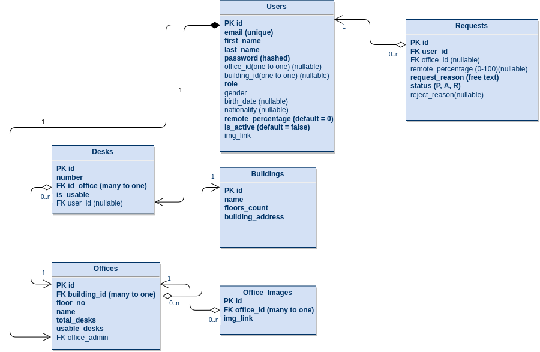

# About

RESTful API implemented using Django Rest Framework. It acts as the backend for an office automation web app.  
Frontend needs to be refreshed after loading the first time.  
Contact me for login credentials.  

# Live 

https://offices-frontend.herokuapp.com/login  
https://offices-backend.herokuapp.com/api/

# API documentation

https://offices-backend.herokuapp.com/swagger/

# Database Schema

