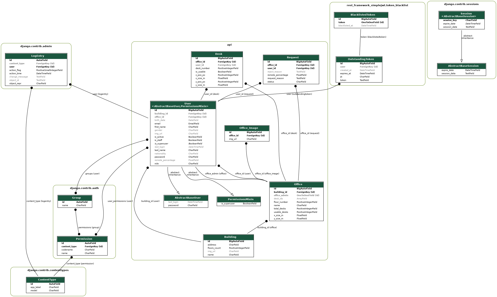

# REST API for Office Space Management

  During my team project, I served as the backend developer, working alongside a frontend developer and a QA member. My responsibilities included designing the database and application architecture, developing the REST API, and deploying the app on Heroku. 

  Utilizing Django Rest Framework and JWT for authentication, I implemented CRUD operations on various entities such as users, buildings, offices, and desks, utilizing a PostgreSQL database. 

  The database was deployed on AWS, and I utilized Core API to generate the API schema. The most challenging aspect of this project was seamlessly integrating the backend into the frontend.

  Technology stack: 

   • Linux 
   • Heroku
   • Postman 
   • Swagger for API documentation
   • PostgreSQL database, remote on AWS
   • REST API with Django Rest Framework 
   • JSON Web Token (jwt) for user authenticationDuring my team project, I served as the backend developer, working alongside a frontend developer and a QA member. My responsibilities included designing the database and application architecture, developing the REST API, and deploying the app on Heroku. Utilizing Django Rest Framework and JWT for authentication, I implemented CRUD operations on various entities such as users, buildings, offices, and desks, utilizing a PostgreSQL database. The database was deployed on AWS, and I utilized Core API to generate the API schema. The most challenging aspect of this project was seamlessly integrating the backend into the frontend. Technology stack: • Linux • Heroku • Postman • Swagger for API documentation • PostgreSQL database, remote on AWS • REST API with Django Rest Framework • JSON Web Token (jwt) for user authentication

RESTful API implemented using Django Rest Framework.  
It acts as the backend for an office automation web app.  

# Database Schema

